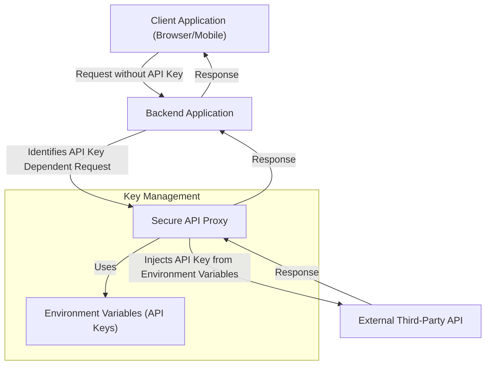

# Secure API Proxy: Architecture and Implementation

## 1. Overview

This document details the architecture and implementation of the secure API proxy, designed to protect sensitive API keys by preventing their exposure in client-side applications. All API key-dependent requests are now routed through this server-side component.

## 2. Architecture

The secure API proxy is implemented as a middleware layer on our existing backend infrastructure. It acts as an intermediary between the client application and external third-party APIs.



**Key Components:**

*   **Client Application:** Makes requests to the backend application's proxy endpoints, *without* including API keys.
*   **Backend Application:** Hosts the API proxy logic. It identifies requests intended for external APIs and forwards them to the proxy.
*   **Secure API Proxy:**
    *   Receives requests from the backend application.
    *   Identifies the target external API based on the request path.
    *   Retrieves the appropriate API key from secure environment variables.
    *   Constructs and forwards the request to the external API, including the securely injected API key.
    *   Receives the response from the external API and forwards it back to the backend application.
*   **Environment Variables:** Stores API keys securely on the server. These keys are *never* exposed to the client. Examples include `GOOGLE_MAPS_API_KEY`, `WEATHER_API_KEY`, etc.
*   **External Third-Party API:** The actual service responding to the request (e.g., Google Maps, Weather API).

## 3. Implementation Details

### 3.1. Technologies Used

*   **Backend Framework:** Node.js (Express), Python (Django/Flask), or similar web framework.
*   **Environment Variable Management:** `dotenv` (Node.js), `python-dotenv` (Python), or native OS environment variables.
*   **HTTP Client:** `axios` (Node.js), `requests` (Python), or built-in `fetch` on the server-side.

### 3.2. Code Structure (Example - Node.js/Express)

```javascript
// In your main application file (e.g., app.js)
const express = require('express');
const axios = require('axios');
require('dotenv').config(); // Load environment variables

const app = express();

// Generic proxy endpoint
app.all('/api/proxy/:service/*', async (req, res) => {
    const service = req.params.service; // e.g., 'googlemaps', 'weatherapi'
    const originalPath = req.params[0]; // The rest of the path after '/:service/'

    let apiKey; 
    let baseUrl; 

    switch (service) {
        case 'googlemaps':
            apiKey = process.env.GOOGLE_MAPS_API_KEY;
            baseUrl = 'https://maps.googleapis.com/maps/api/';
            break;
        case 'weatherapi':
            apiKey = process.env.WEATHER_API_KEY;
            baseUrl = 'http://api.weatherapi.com/v1/';
            break;
        // Add more services as needed
        default:
            return res.status(404).send('Unknown service');
    }

    if (!apiKey) {
        console.error(`API key for service ${service} is not defined.`);
        return res.status(500).send('Server configuration error: API key missing.');
    }

    const targetUrl = `${baseUrl}${originalPath}`;

    // Construct query parameters, injecting the API key
    const queryParams = { ...req.query };
    if(service === 'googlemaps' || service === 'weatherapi') { // Example of how to add API key to query
        queryParams.key = apiKey; // Or apiKey for some services
    }
    // For services where API key is in headers or body, adjust here

    try {
        const response = await axios({
            method: req.method,
            url: targetUrl,
            headers: { 
                ...req.headers, 
                host: new URL(baseUrl).host, // Override host header for proxying
            },
            params: queryParams,
            data: req.body, // For POST/PUT requests
        });

        res.status(response.status).json(response.data);
    } catch (error) {
        console.error(`Error proxying request to ${service}:`, error.message);
        if (error.response) {
            res.status(error.response.status).json(error.response.data);
        } else {
            res.status(500).send('Internal Server Error');
        }
    }
});

// Start server etc.
const PORT = process.env.PORT || 3000;
app.listen(PORT, () => {
    console.log(`Server running on port ${PORT}`);
});
```

### 3.3. API Key Storage

API keys **must** be stored as environment variables on the server where the backend application is deployed. **Never hardcode API keys directly into the codebase or commit them to version control.**

**Example `.env` file (local development):**

```
GOOGLE_MAPS_API_KEY=your_google_maps_api_key_here
WEATHER_API_KEY=your_weather_api_key_here
```

In production environments, leverage your deployment platform's secrets management features (e.g., AWS Secrets Manager, Google Secret Manager, Kubernetes Secrets) to inject these environment variables securely at runtime.

### 3.4. Security Considerations

*   **Input Validation:** Ensure all incoming requests to the proxy are properly validated to prevent injection attacks or malformed requests.
*   **Rate Limiting:** Implement rate limiting on proxy endpoints to prevent abuse and protect external APIs.
*   **Logging:** Log requests and errors for monitoring and debugging, but **never log API keys**.
*   **Error Handling:** Provide robust error handling to prevent sensitive information (like internal errors or API keys) from being exposed in error messages returned to the client.
*   **CORS:** Properly configure CORS headers if the client and backend are on different domains.

## 4. Deployment

When deploying, ensure that:

*   Environment variables containing API keys are correctly configured on the server.
*   The backend application has network access to the external third-party APIs.
*   The proxy endpoints are properly secured with appropriate authentication and authorization (e.g., only authenticated users can trigger specific proxy requests).

---

*Last Updated: 2023-10-27*