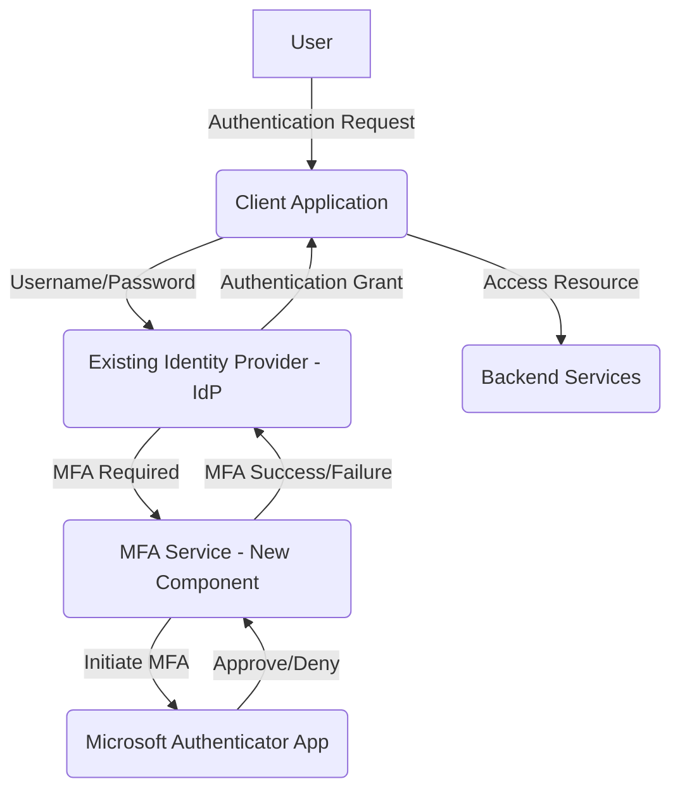

# App-Based MFA Solution Design Document

## 1. Introduction
This document outlines the research, design, and architectural decisions for integrating app-based Multi-Factor Authentication (MFA) to replace the existing SMS-based MFA system. The goal is to enhance user experience, streamline the authentication process, and mitigate delays, particularly for traveling employees.

## 2. Research and Evaluation of Potential App-Based MFA Solutions

### 2.1. Evaluation Criteria
*   **Security:** Robustness against common attacks (phishing, man-in-the-middle), compliance with industry standards.
*   **Usability:** Ease of setup, intuitive user experience, minimal friction during authentication.
*   **Integration Effort:** Compatibility with existing identity providers (IdP), availability of SDKs/APIs, complexity of implementation.
*   **Scalability:** Ability to support a growing user base.
*   **Cost:** Licensing, infrastructure, and maintenance costs.

### 2.2. Solutions Evaluated

#### a) Google Authenticator
*   **Pros:** Widely adopted, open-source (TOTP algorithm), simple to use, high security.
*   **Cons:** No built-in account recovery, relies on manual QR code scanning for setup, lacks advanced features like push notifications.
*   **Integration:** Requires backend implementation of TOTP algorithm for validation.

#### b) Microsoft Authenticator
*   **Pros:** Supports TOTP and push notifications, good integration with Azure Active Directory (AAD), passwordless options, account backup.
*   **Cons:** Primarily designed for Microsoft ecosystems, potentially higher integration effort outside of AAD.
*   **Integration:** APIs available for custom application integration, good for hybrid environments.

#### c) Okta Verify
*   **Pros:** Comprehensive IdP solution, push notifications, biometrics, phishing resistance, strong integration with Okta identity platform.
*   **Cons:** Requires commitment to Okta's ecosystem, potentially higher cost.
*   **Integration:** Native integration with Okta's APIs and SDKs.

### 2.3. Chosen Solution: Microsoft Authenticator (Hybrid Approach)
Microsoft Authenticator is chosen due to its balance of security, usability, and flexibility. Its support for both TOTP and push notifications provides a good user experience, and its integration capabilities offer flexibility for diverse environments. This allows us to leverage its push notification features while maintaining compatibility with other IdPs if needed.

## 3. Architectural Design for Integrating Microsoft Authenticator

### 3.1. High-Level Architecture

### 3.2. Components
*   **Client Application:** Web or mobile application initiating the authentication flow.
*   **Existing Identity Provider (IdP):** Our current authentication system (e.g., Auth0, Azure AD, custom IdP) responsible for primary authentication.
*   **MFA Service (New Component):** A new microservice or module responsible for orchestrating the MFA flow with Microsoft Authenticator. This service will interact with the Microsoft Graph API for push notifications and potentially include a TOTP validation mechanism if required for fallback or broader compatibility.
*   **Microsoft Authenticator App:** The mobile application installed on the user's device.
*   **Backend Services:** Application resources protected by authentication.

## 4. Detailed Solution Design

### 4.1. Data Flows

#### 4.1.1. Enrollment Flow
1.  **User Initiates Enrollment:** User navigates to a profile management section in the client application and chooses to set up app-based MFA.
2.  **IdP Initiates Enrollment:** The IdP issues a request to the MFA Service to generate an enrollment QR code/link.
3.  **MFA Service Generates Enrollment:** The MFA Service interacts with Microsoft Graph API (for push) or generates a TOTP secret and corresponding QR code.
4.  **QR Code Display:** The client application displays the QR code to the user.
5.  **User Scans QR Code:** User scans the QR code with the Microsoft Authenticator app.
6.  **App Registers:** The Microsoft Authenticator app registers with the MFA Service (via Microsoft Graph/TOTP setup) and the user's device is linked.
7.  **MFA Service Confirms Enrollment:** The MFA Service confirms successful enrollment to the IdP.
8.  **IdP Updates User Profile:** The IdP marks the user's account as MFA-enabled with the chosen method.

#### 4.1.2. Authentication Flow (Push Notification)
1.  **User Enters Credentials:** User enters username and password into the client application.
2.  **IdP Authenticates Primary:** The IdP authenticates the primary credentials.
3.  **IdP Requests MFA:** If MFA is enabled, the IdP requests MFA from the MFA Service.
4.  **MFA Service Sends Push:** The MFA Service uses Microsoft Graph API to send a push notification to the user's registered Microsoft Authenticator app.
5.  **User Approves/Denies:** User approves or denies the request in the app.
6.  **MFA Service Receives Response:** The MFA Service receives the user's response from Microsoft Graph.
7.  **MFA Service Informs IdP:** The MFA Service informs the IdP of the MFA outcome.
8.  **IdP Grants Access:** If approved, the IdP grants access to the client application.

#### 4.1.3. Authentication Flow (TOTP Fallback/Alternative)
1.  **User Enters Credentials:** User enters username and password into the client application.
2.  **IdP Authenticates Primary:** The IdP authenticates the primary credentials.
3.  **IdP Requests MFA:** If MFA is enabled and TOTP is selected or push fails, the IdP requests a TOTP code from the user.
4.  **User Enters TOTP:** User enters the code generated by their Microsoft Authenticator app.
5.  **MFA Service Validates TOTP:** The MFA Service (or IdP if it has TOTP capabilities) validates the provided TOTP code against the stored secret.
6.  **IdP Grants Access:** If valid, the IdP grants access to the client application.

### 4.2. Security Considerations
*   **Communication Security:** All communications between components must use TLS 1.2+.
*   **Secret Management:** TOTP secrets and API keys for Microsoft Graph must be securely stored (e.g., using a secrets manager).
*   **Rate Limiting:** Implement rate limiting on MFA requests to prevent brute-force attacks.
*   **Logging and Auditing:** Comprehensive logging of MFA events (enrollment, authentication success/failure) for auditing and security monitoring.
*   **Account Recovery:** Implement a secure account recovery process for lost/stolen devices, potentially involving IT support or a pre-registered backup method.
*   **Phishing Resistance:** While push notifications offer some resistance, educate users about verifying login details within the app.

## 5. Necessary Changes to Existing Identity Management APIs or Backend Services

### 5.1. Identity Provider (IdP) Changes
*   **MFA Configuration:** Update user profiles to store app-based MFA enrollment status and selected method (push/TOTP).
*   **MFA Orchestration:** Modify authentication flows to invoke the new MFA Service for app-based verification.
*   **API Endpoints:** Potentially new IdP API endpoints for MFA enrollment initiation and status updates.

### 5.2. New MFA Service (Backend)
*   **API Endpoints:**
    *   `POST /mfa/enroll/initiate`: Initiates app-based MFA enrollment, generates QR code/link.
    *   `POST /mfa/enroll/complete`: Completes enrollment, links device with user.
    *   `POST /mfa/authenticate/initiate`: Sends push notification or requests TOTP.
    *   `POST /mfa/authenticate/verify`: Verifies push notification response or TOTP code.
*   **External Integrations:** Microsoft Graph API integration for push notifications.
*   **Database:** Secure storage for TOTP secrets (if used for fallback/alternative), device registration information, and user MFA preferences (encrypted).

### 5.3. Client Application Changes
*   **User Interface:** New UI for MFA enrollment (QR code display, link to app stores), UI for push notification waiting state, and TOTP code input.
*   **API Integration:** Integration with IdP and MFA Service APIs for enrollment and authentication steps.

## 6. Pilot Group Selection and Initial Rollout Strategy

### 6.1. Pilot Group Selection
*   **Criteria:** A diverse group of 50-100 employees, including a mix of technical and non-technical users, and at least 10-15 traveling employees.
*   **Volunteers:** Encourage volunteers to identify highly motivated users.
*   **IT Department First:** Start with the IT department to gather early feedback and address any significant issues before broader rollout.

### 6.2. Initial Rollout Strategy
1.  **Pre-Pilot Communication:** Announce the upcoming change, its benefits, and provide initial instructions to the pilot group.
2.  **Pilot Onboarding:** Conduct training sessions for the pilot group, provide step-by-step guides for enrollment and usage.
3.  **Feedback Collection:** Establish clear channels for feedback (e.g., dedicated Slack channel, survey forms, direct contacts).
4.  **Monitoring:** Closely monitor authentication logs, MFA success/failure rates, and system performance during the pilot.
5.  **Iteration:** Address identified issues and refine the solution and documentation based on pilot feedback.
6.  **Phased Rollout:** After successful pilot and resolution of issues, gradually roll out to other departments, starting with smaller groups and expanding.
7.  **Decommissioning SMS MFA:** Once a significant portion of users have migrated and the new system is stable, phase out SMS MFA, providing ample notice to remaining users.

## 7. Documentation and Training
*   **Admin Guide:** Documentation for IT administrators on managing MFA enrollment, troubleshooting, and recovery.
*   **User Guide:** Step-by-step instructions for employees on how to enroll, authenticate, and recover their app-based MFA.
*   **FAQ:** Address common questions and troubleshooting tips.
*   **Training Sessions:** Conduct online and in-person training sessions for employees.
*   **Communication Plan:** Regular communications to inform employees about the changes, benefits, and support resources.